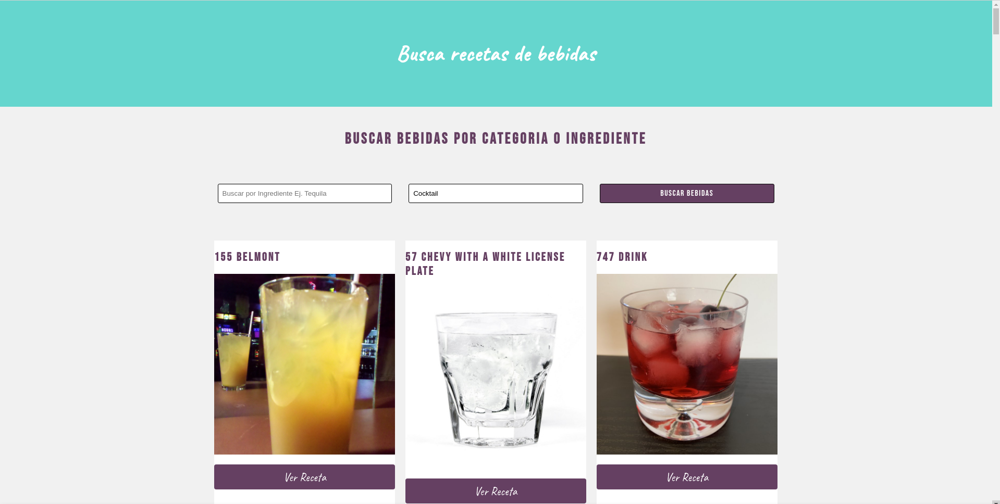

# Buscador de bebidas hecho con react context y css

Runs the app in the development mode.\
Open [http://localhost:3000](http://localhost:3000) to view it in the browser.

## Para reconstruir los módulos de node:

```
npm install
```

## Available Scripts

Para correr la aplicación (una vez recontruidos los módulos de node):

```
npm start
```

### Foto de muestra:


